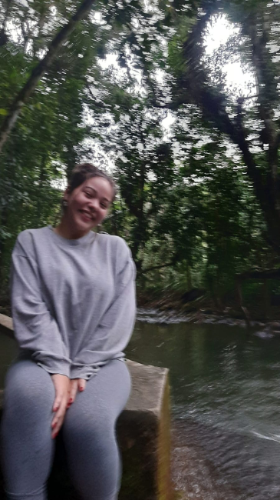
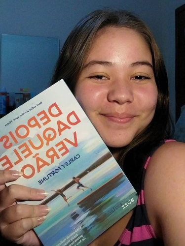
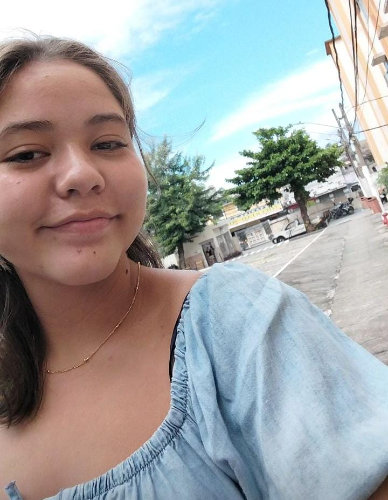
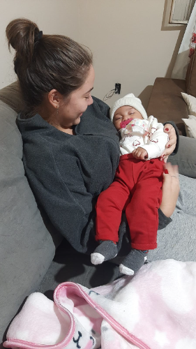
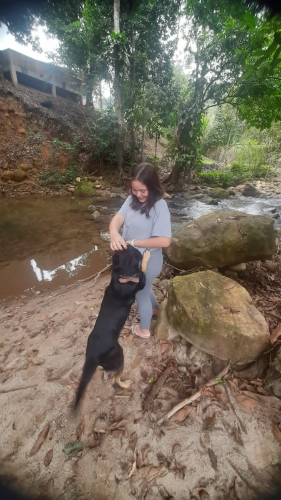
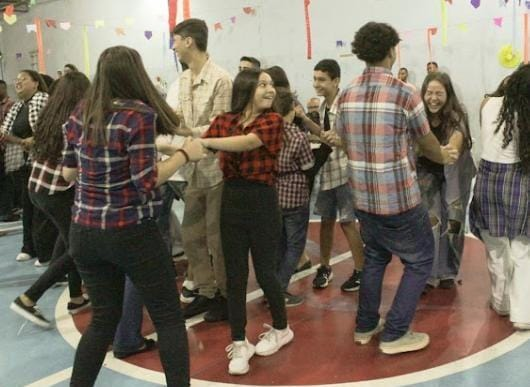
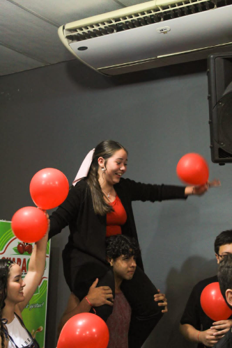
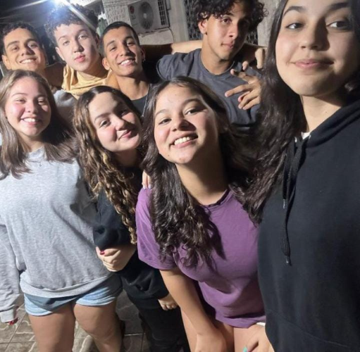

<!DOCTYPE html>
<html lang="pt-br">
<head>
    <meta charset="UTF-8">
    <meta name="viewport" content="width=device-width, initial-scale=1.0">
    <title>De Arthur para Letícia</title>
    <link rel="apple-touch-icon" sizes="180x180" href="/arquivosdoprojeto/android-chrome-192x192.png">
    <link rel="icon" type="image/png" sizes="32x32" href="arquivosdoprojeto/favicon-32x32.png">
    <link rel="icon" type="image/png" sizes="16x16" href="arquivosdoprojeto/favicon-16x16.png">
    <link rel="manifest" href="arquivosdoprojeto/site.webmanifest">
  
   
</head>
<body>
    <form id="loginForm">
        <input type="password" id="passwordInput" placeholder="Digite a senha">
        <button type="button" onclick="checkPassword()">Entrar</button>
    </form>
    

    <header>
        <h1>Bem vinda senhorita Sol</h1>
    </header>
    <main>
        <article>
            <h2>Espero que goste!</h2>
            
Leh,eu queria te dar algo em agradecimento aos momentos bons que estou passando ao seu lado, mas não sabia o que escolher. Então, decidi fazer isso em forma de uma página e tentei montar tudo aqui pensando em você!

            <h2>Seu Sorriso</h2>
            

                Desde que eu te conheci, vi de cara a pessoa simpática e agradável que você era. Mas foi só me aproximando que pude perceber o impacto que você causa nas pessoas, especialmente em mim.
            

            

                
                
            

            

                Vou começar falando desse sorriso que me pega de jeito. Acabo me perdendo nele muito facilmente e acho que você sabe disso. Chega a ser maldade a forma como o seu sorriso tira minha atenção e me traz paz de certa forma.Eu poderia tentar falar mais ,porém é dificil de explicar e vou cabar me embolando
            

            

                Esse é um dos motivos egoístas de eu querer sempre te ver alegre! para que você não pare de sorrir!Acaba sendo impossivel ver o seu sorriso e não sorrir tbm!
            

            <h2>Leh autora</h2>
            
Vamos falar da chata que é viciada em livros agora...

            

                
                
            

            

                Assim que a gente entra na sua página, está escrito: "Autora de romances fofos, fantasia e pessoas traumatizadas." Ênfase em traumatizadas (brincadeira). Acho incrível o empenho e o amor que você tem pelos livros, e aposto que isso foi uma grande parte do que te ajudou a ser uma pessoa tão cheia de conteúdo! Ver sua paixão pelos livros está quase me fazendo tentar criar o hábito de ler também. Mesmo achando você um pouco louca às vezes, eu adoro essa Leh apaixonada por histórias. Os livros acabam sendo sua terapia, assim como o futebol é a minha, então eu admiro sua paixão porque de certa forma, eu entendo como é. 
            

            

                Dialogar na festa :não  
                ficar no kindle até a festa acabar: lógico!!
            

            

                "Ler livros não é um ato é um sentimento"
            

           <h2>Gentileza e Empatia</h2>
           
Sobre gentileza e empatia, eu poderia dizer que você é tipo um sinônimo dessas duas palavras.

           

            
            
           

           

             Me aproximando de você, vi o carinho que você tem com as pessoas. Sua gentileza fala muito alto, e sua empatia te torna diferente. Mesmo eu não concordando com certas atitudes suas, como ser gentil demais e as pessoas acabarem se aproveitando, eu nunca vou brigar com você por isso. Não é você que está fazendo o mal, e sim o mundo que trata pessoas incríveis de forma errada! Só lembre de ser gentil com você em primeiro lugar.
           

           
"A gentileza é o jeito mais bonito de ser o sol no dia nublado de alguem."

           <h2>Momentos</h2>
           
Uma coisa que eu e você concordamos e que momentos são definidos mais pelas pessoas que nos rodeiam do que sobre o local em si! 

           

            
           

           
Como não falar dessa festa junina? Foi aí que a gente conversou pela primeira vez de verdade. Esse dia foi muito bom e engraçado. Eu estava entre os meus amigos e consegui conhecer muita gente boa. Falei com você, e foi um dos maiores arrependimentos da minha vida! Se eu soubesse que ia arrumar uma companhia tão chata, voltava no tempo kkkkk. Brincadeiras à parte, esse dia me traz boas lembranças. Inclusive, para quem não gosta de dançar, esse sorriso na foto me diz outra coisa.

           

            
           

           
O time vermelho foi o melhor, disparado. A Naylla claramente doida, GB no grito, eu, Kauan e você no suporte (só maluco). A animação foi legal. Admito que sou bem competitivo, mas nesse caso eu não estava ligando muito. Porém, o time deu a vida e, mesmo perdendo naquele dia (roubado!!), a alegria da galera, especialmente a sua, foi boa de se ver.

           
E falando em vermelho, lembrei da sua irmã dizendo que você era Vasco, mas você me mandou essa pérola aqui e me provou o contrário.
           

           <audio controls>
            <source src="arquivosdoprojeto/audio1.ogg" type="audio/ogg">
        </audio>
           

            
           

           
Eu poderia continuar falando sobre esses momentos, inclusive sobre o dia maravilhoso da foto de cima, mas estou mais preocupado com os próximos momentos que vão chegar. Não vou me aprofundar muito para não me expor...
           

           
Espero que tenha gostado disso senhorita , do mesmo jeito que eu tenho gostado de passar o tempo com você.

           <audio controls>
            <source src="arquivosdoprojeto/audio2.ogg" type="audio/ogg">
        </audio>
        </article>
    </main>
    

    
    
</body>
</html>
